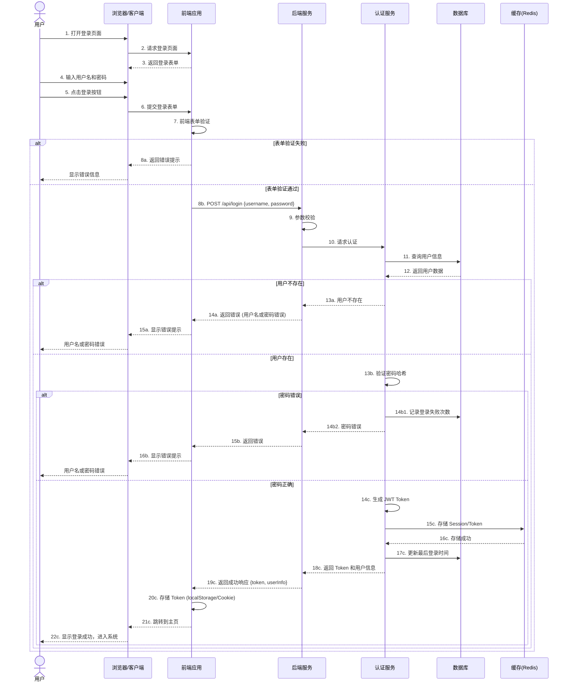
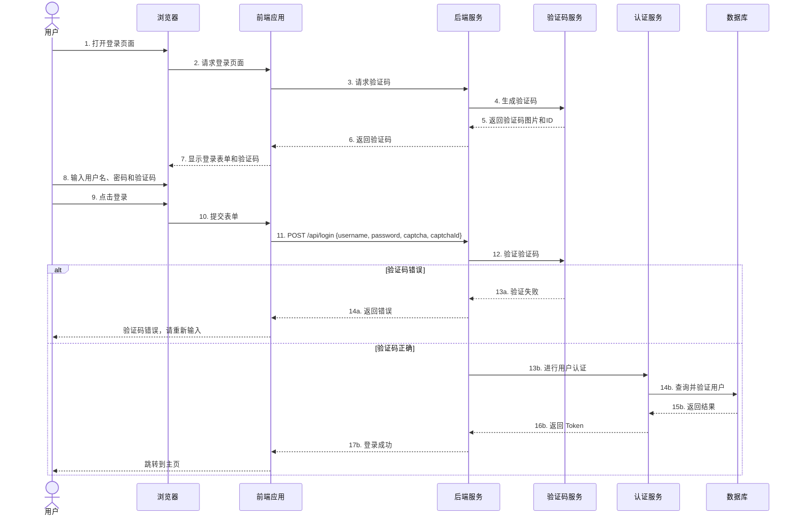
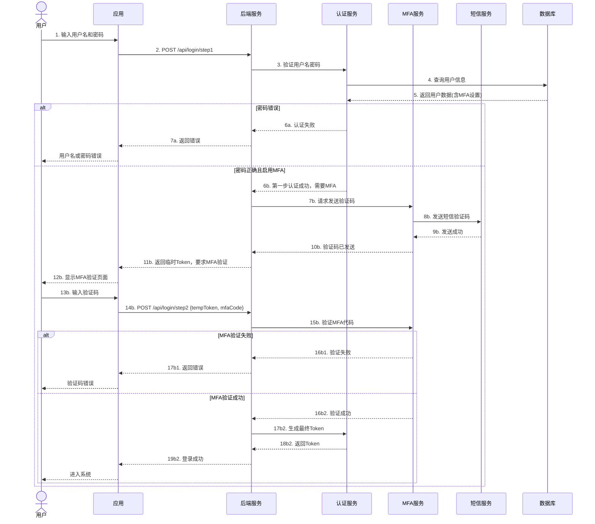

# 用户登录流程时序图

## 基础登录流程

## 带验证码的登录流程

## 多因素认证(MFA)登录流程

## 使用说明

### 文件格式
- 本文件使用 Mermaid 语法编写时序图
- 可在支持 Mermaid 的工具中查看，例如：
  - GitHub/GitLab（直接预览）
  - VS Code（安装 Mermaid 插件）
  - 在线工具：https://mermaid.live/

### 流程说明

**基础登录流程**包含：
- 前端表单验证
- 用户认证
- 密码哈希验证
- Token 生成与存储
- 登录失败处理

**带验证码流程**增加：
- 验证码生成与验证
- 防止暴力破解

**多因素认证流程**增加：
- 两步验证
- 短信验证码
- 临时 Token 机制

### 关键安全点

1. **密码处理**：使用哈希存储，不返回明文
2. **错误提示**：用户不存在和密码错误返回相同提示
3. **失败次数**：记录登录失败次数，防止暴力破解
4. **Token 管理**：使用 JWT 或 Session，设置过期时间
5. **验证码**：防止自动化攻击
6. **MFA**：高安全场景的必要措施
